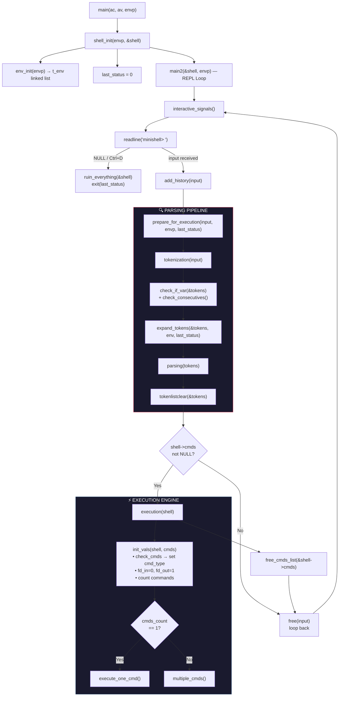
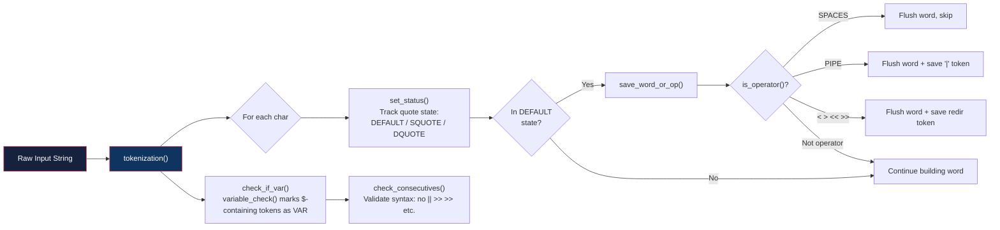
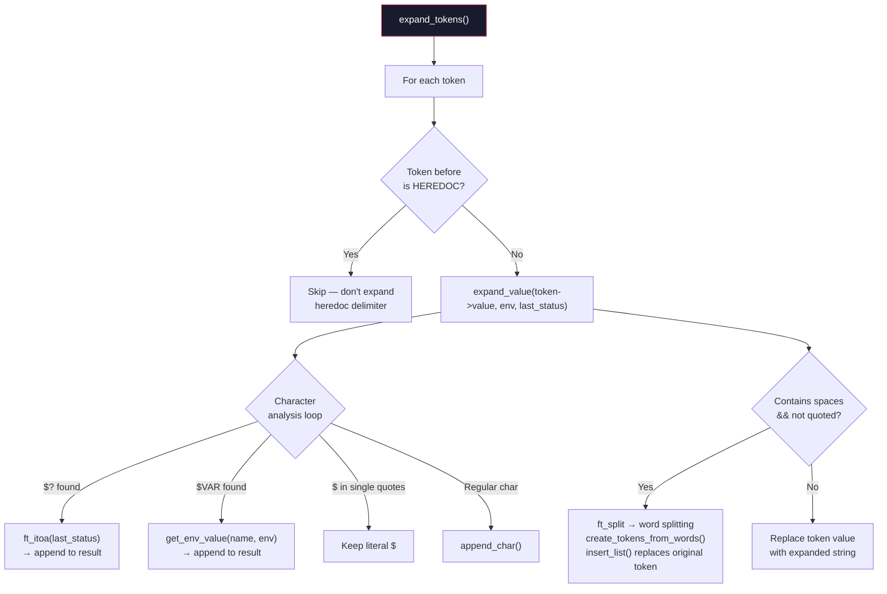
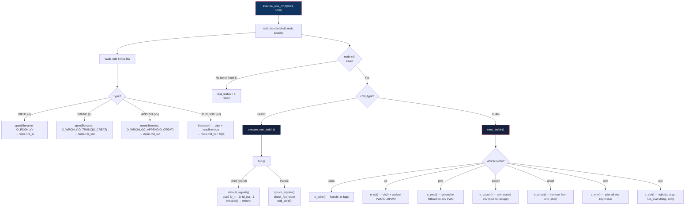
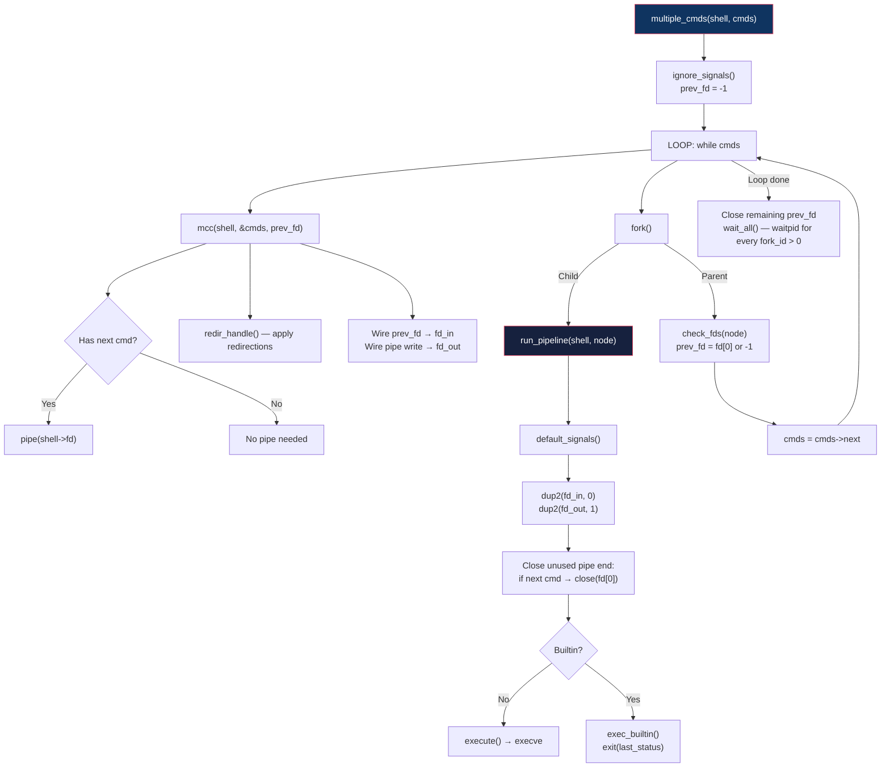
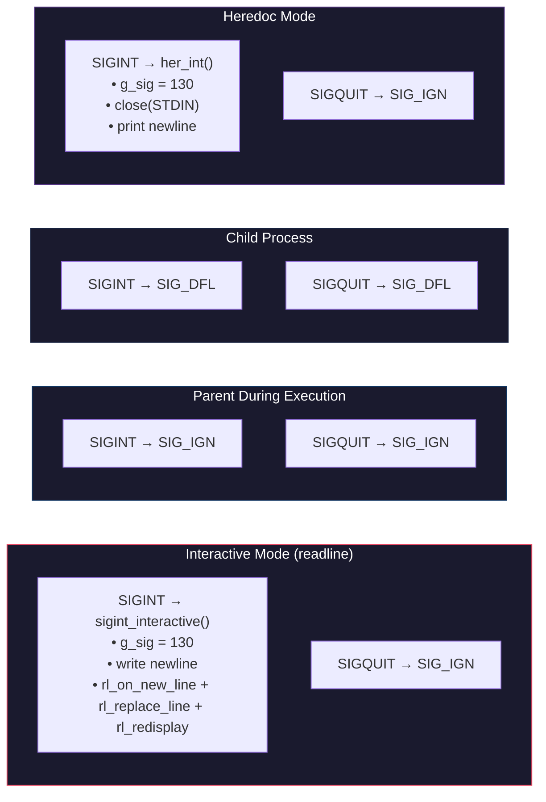
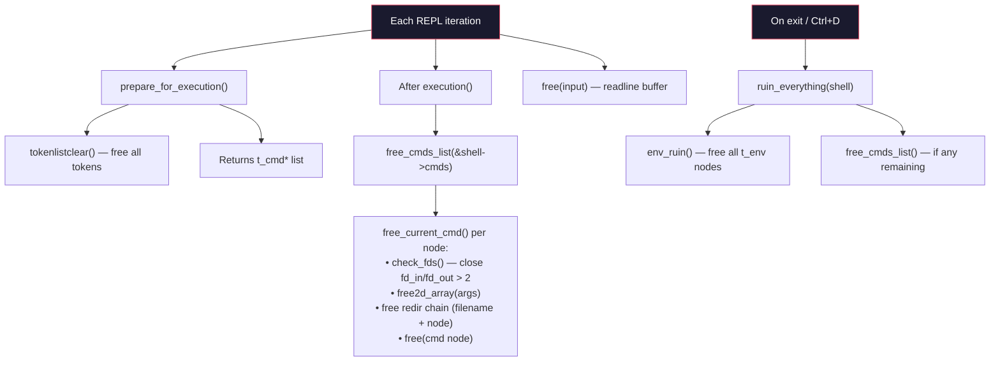

# 🐚 Minishell — Complete Internal Architecture & Evaluation Cheatsheet

## 📦 Project Structure Overview

```
Minishell/
├── headers/
│   ├── libs.h                  ← System includes, macros (BUFFERSIZE, SUCCESS/FAILURE)
│   ├── parsingpart.h           ← Parsing structs: t_token, t_cmd, t_redir + parsing API
│   └── executionpart.h         ← Execution structs: t_env, t_exec + execution API
├── src/
│   ├── tokenizer/
│   │   └── tokenization.c      ← Lexer: raw input → token linked list
│   ├── expander/
│   │   ├── expansion.c         ← $VAR / $? expansion + word splitting
│   │   └── inserting.c         ← Token list manipulation for split words
│   ├── parse/
│   │   ├── parsing.c           ← Token list → command linked list (t_cmd)
│   │   ├── parsing_args.c      ← Extract args array from tokens
│   │   ├── parsing_cmd.c       ← t_cmd node creation, free, traversal
│   │   └── parsing_redir.c     ← Extract redirections → t_redir linked list
│   ├── execution/
│   │   ├── main.c              ← Entry point, REPL loop, prepare_for_execution()
│   │   ├── execution.c         ← Dispatcher: single vs pipeline, fork/pipe helpers
│   │   ├── executeone.c        ← Single command: builtin or fork+execve
│   │   ├── execute-multiple.c  ← Pipeline: pipe chain, fork per stage, wait_all
│   │   ├── heredoc.c           ← Heredoc: pipe+readline loop, $VAR expansion
│   │   ├── io-redir.c          ← Apply >, >>, < redirections via open()
│   │   ├── signals.c           ← SIGINT/SIGQUIT handlers (interactive/ignore/default)
│   │   ├── built-ins.c         ← export (stub)
│   │   ├── built-ins2.c        ← exec_builtin dispatcher, env, exit
│   │   ├── built-ins3.c        ← echo, pwd, unset (stub)
│   │   ├── built-ins4.c        ← cd, replace/get_value env helpers
│   │   └── error-handle.c      ← Free functions, error display, ruin_everything
│   ├── utils/
│   │   ├── e_utils.c           ← ft_strcmp, init_vals (set fd_in=0, fd_out=1)
│   │   ├── e_utils2.c          ← shell_init, g_sig, check_cmds, free2d_array
│   │   ├── env-utils3.c        ← t_env linked list: init, add, ruin
│   │   ├── expansion_utils.c   ← is_var_char, get_env_value, append_char/str
│   │   ├── lexer_utils.c       ← save_op, save_word, is_operator, set_status
│   │   ├── list_utils.c        ← t_token linked list: new, addback, clear, del_one
│   │   └── syntax_error.c      ← check_consecutives, check_if_var
│   └── libft/                  ← 42 standard library
└── readline.supp               ← Valgrind suppressions for readline leaks
```

---

## 🔄 Complete Execution Flow



---

## 🔍 Tokenization Detail



**Token Types:** `WORD` | `PIPE` | `INPUT(<)` | `TRUNC(>)` | `APPEND(>>)` | `HEREDOC(<<)` | `SPACES` | `VAR` | `END`

---

## 🧬 Expansion Detail



> [!IMPORTANT]
> **Expansion Rules for Evaluation:**
> - `$VAR` expands in double quotes and unquoted
> - `$VAR` does NOT expand in single quotes  
> - `$?` expands to last exit status
> - Unquoted expansion with spaces triggers **word splitting**
> - Heredoc delimiter is NOT expanded; heredoc **content** IS expanded (unless delimiter was quoted)

---

## ⚡ Single Command Execution



---

## 🔗 Pipeline Execution (multiple_cmds)



---

## 📡 Signal Handling



---

## 🧹 Memory Management Flow



---

## 🗂️ Core Data Structures

### `t_exec` — Shell State
| Field | Type | Purpose |
|-------|------|---------|
| `envp` | `char**` | Raw env array (passed from main) |
| `cmds_count` | `int` | Number of commands in current line |
| `fd[2]` | `int[2]` | Current pipe file descriptors |
| `last_status` | `int` | `$?` — last exit status |
| `first_env_node` | `t_env*` | Env linked list head |
| `sorted_env` | `t_env*` | Sorted env for `export` display |
| `cmds` | `t_cmd*` | Current command list head |

### `t_cmd` — Single Command Node
| Field | Type | Purpose |
|-------|------|---------|
| `fork_id` | `int` | PID from fork() or 0 |
| `ret_stat` | `int` | Return status (unused directly) |
| `fd_in` | `int` | Input FD (0=stdin, or pipe/redir) |
| `fd_out` | `int` | Output FD (1=stdout, or pipe/redir) |
| `args` | `char**` | NULL-terminated argument array |
| `cmd_type` | `t_cmd_type` | NONE/ECHO/CD/PWD/EXPORT/UNSET/ENV/EXIT |
| `redir` | `t_redir*` | Redirection linked list |
| `next` | `t_cmd*` | Next command in pipeline |

### `t_redir` — Redirection Node
| Field | Type | Purpose |
|-------|------|---------|
| `filename` | `char*` | Target file or heredoc delimiter |
| `quoted` | `int` | Was delimiter quoted? (heredoc: no expansion) |
| `type` | `t_token_type` | INPUT/TRUNC/APPEND/HEREDOC |
| `next` | `t_redir*` | Next redirection |

### `t_token` — Lexer Token
| Field | Type | Purpose |
|-------|------|---------|
| `value` | `char*` | Token string |
| `type` | `t_token_type` | WORD/PIPE/INPUT/TRUNC/APPEND/HEREDOC/VAR/END |
| `quoted` | `int` | Contains quotes (affects word splitting) |
| `prev/next` | `t_token*` | Doubly-linked list pointers |

---

## 🎯 Evaluation Checklist — Quick Reference

### Things That Work ✅
- [x] echo with/without -n, -nnnnn, mixed flags
- [x] pwd (with getcwd fallback)
- [x] cd (HOME, absolute, relative, .., error cases)
- [x] env (prints KEY=VALUE)
- [x] exit (numeric, non-numeric, too many args, wrapping)
- [x] $VAR expansion in double quotes and unquoted
- [x] $VAR NOT expanded in single quotes
- [x] $? expansion
- [x] Pipes (multi-stage pipelines)
- [x] Redirections: >, >>, <
- [x] Heredoc with expansion and quoted delimiter
- [x] Signal handling: Ctrl+C in interactive/execution/heredoc
- [x] Ctrl+D exits cleanly
- [x] Ctrl+\ ignored in interactive mode

### Known Limitations / Watch During Eval ⚠️
- [ ] `export` with arguments — **STUB** (no `export KEY=VALUE` implementation)
- [ ] `unset` — **STUB** (loop body is empty, doesn't actually remove vars)
- [ ] `export` display doesn't sort alphabetically
- [ ] `envp` is the **original** `char**` from `main()` — not rebuilt after export/unset changes
- [ ] `error_display()` hardcodes `last_status = 2` — may cause wrong exit codes
- [ ] Heredoc SIGINT: closes STDIN_FILENO directly (risky, but restored via `dup`)
- [ ] `e_exit` writes "exit\n" to stderr even when `node->next` exists in a pipeline? (line 73 checks `!node->next`)
- [ ] No support for `||`, `&&`, `()`, wildcards (not required by subject)

### File Descriptor Safety Points 🔒
1. **Pipe FDs**: Created in `mcc()`, read-end carried as `prev_fd`, write-end assigned to `fd_out`
2. **Redir FDs**: Old FD closed if > 2 before assigning new one
3. **Heredoc FD**: `pipe()` created, write-end closed after loop, read-end becomes `fd_in`
4. **check_fds()**: Closes `fd_in`/`fd_out` if > 2, resets to 0/1
5. **apply_fd()**: `dup2() + close()` — standard pattern
6. **Potential leak**: If `pipe()` fails in `mcc()`, `fork_id` set to -1 but `prev_fd` might not be closed

---

## 🏗️ How Input Flows Through the System

```
User types: echo "hello $USER" | cat > out.txt

Step 1 — TOKENIZE:
  [echo] [WORD] → ["hello $USER"] [WORD,quoted] → [|] [PIPE] → [cat] [WORD] → [>] [TRUNC] → [out.txt] [WORD]

Step 2 — SYNTAX CHECK:
  check_if_var() → marks "$USER" token as VAR type
  check_consecutives() → validates no invalid sequences

Step 3 — EXPAND:
  "hello $USER" → "hello moabed" (expands $USER, keeps quotes removed)

Step 4 — PARSE → t_cmd linked list:
  CMD1: args=["echo", "hello moabed"], redir=NULL, next→CMD2
  CMD2: args=["cat"], redir→{type=TRUNC, filename="out.txt"}, next=NULL

Step 5 — EXECUTE (cmds_count=2 → multiple_cmds):
  pipe(fd)
  CMD1: fd_in=0, fd_out=fd[1] → fork → execve("echo", ...)
  CMD2: fd_in=fd[0], fd_out=open("out.txt") → fork → execve("cat", ...)
  wait_all()
```
