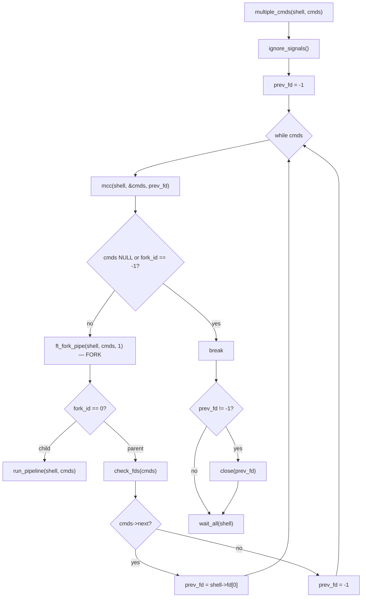

# Minishell Deep Audit: Free Functions, Parsing, & Pipeline

---

## Part 1: Error-Handle Free Functions

### 1.1 `free_current_cmd` — [error-handle.c:29](file:///home/moabed/Documents/Minishell/src/execution/error-handle.c#L29-L51)

```c
void free_current_cmd(t_cmd **node)
{
    ...
    free2d_array(ptr->args);
    r = ptr->redir;
    while (r)
    {
        tmp = r->next;
        // to be checked
        // free(r->filename);   // <--- COMMENTED OUT!
        free(r);
        r = tmp;
    }
    free(ptr);
}
```

> [!CAUTION]
> **`r->filename` is NEVER freed** — this is a confirmed memory leak.

The parser allocates `filename` via `ft_strdup` in [redir_new](file:///home/moabed/Documents/Minishell/src/parse/parsing_redir.c#L15-L27):
```c
redir->filename = ft_strdup(filename);  // HEAP allocation
```

**Fix:** Uncomment `free(r->filename);` on line 46.

### 1.2 `free_current_cmd` vs `free_cmds` (parser) — Two Different Free Paths

| Function | File | Frees `args`? | Frees `redir->filename`? | Closes FDs? |
|---|---|---|---|---|
| `free_current_cmd` | error-handle.c (execution) | ✅ via `free2d_array` | ❌ **LEAKED** | ✅ via `check_fds` |
| `free_cmds` | parsing_cmd.c (parser) | ✅ via `free_args` | ✅ via `free_redirs` | ❌ N/A |

> [!IMPORTANT]
> These two functions **should free the same fields**. `free_current_cmd` must also free `redir->filename`.

### 1.3 `ruin_everything` — [error-handle.c:53](file:///home/moabed/Documents/Minishell/src/execution/error-handle.c#L53-L62)

```c
void ruin_everything(t_exec *shell)
{
    if (shell->first_env_node)
        env_ruin(&shell->first_env_node);
    if (shell->cmds)
    {
        free_cmds_list(&shell->cmds);
        shell->cmds = NULL;
    }
}
```

> [!WARNING]
> **Missing: `shell->envp` is never freed.** `shell_init` sets `shell->envp = env` (the raw `main` argv-style pointer), so this is fine for the original envp. But if you ever reassign `shell->envp` to a heap-allocated copy (e.g., before `execve`), you'll leak it. Currently safe but fragile.

> [!WARNING]
> **Missing: `shell->sorted_env` is not freed here.** If the shell exits while `sorted_env` is non-NULL (unlikely but possible), it leaks.

### 1.4 `free_cmds_list` — [error-handle.c:64](file:///home/moabed/Documents/Minishell/src/execution/error-handle.c#L64-L79)

Walks the linked list calling `free_current_cmd` per node. Logic is correct, but inherits the `filename` leak from `free_current_cmd`.

### 1.5 `errmsg` — [error-handle.c:81](file:///home/moabed/Documents/Minishell/src/execution/error-handle.c#L81-L107)

This function chains `ft_strjoin` calls and frees intermediates correctly. ✅ No leak.

---

## Part 2: Parsing Allocation vs Execution Free — Match Check

### What the parser allocates per `t_cmd`:

| Field | Allocated by | How |
|---|---|---|
| `t_cmd` node | `cmd_new` → `malloc` | single struct |
| `cmd->args` | `fill_args` → `malloc` array | each `args[i]` = `ft_strdup(token->value)` |
| `cmd->redir` | `parse_redirs` → `redir_new` → `malloc` | linked list |
| `redir->filename` | `redir_new` → `ft_strdup(filename)` | heap string |

### What `free_current_cmd` frees:

| Field | Freed? | Status |
|---|---|---|
| `cmd->args` array + strings | ✅ `free2d_array` | Correct |
| `cmd->redir` nodes | ✅ `free(r)` per node | Correct |
| `redir->filename` | ❌ **Commented out** | **BUG — LEAK** |
| `cmd` struct | ✅ `free(ptr)` | Correct |
| FDs (`fd_in`, `fd_out`) | ✅ `check_fds` | Correct |

### Parser's own `free_cmds` (used on parse failure):

| Field | Freed? | Status |
|---|---|---|
| `cmd->args` | ✅ `free_args` | Correct |
| `cmd->redir` + `redir->filename` | ✅ `free_redirs` | Correct |
| `cmd` struct | ✅ `free(cmds)` | Correct |

> [!IMPORTANT]
> **Summary:** The only mismatch is `redir->filename`. Uncomment the free in `free_current_cmd`, or better yet, call `free_redirs` instead of the manual loop:

```diff
 void free_current_cmd(t_cmd **node)
 {
     ...
     free2d_array(ptr->args);
-    r = ptr->redir;
-    while (r)
-    {
-        tmp = r->next;
-        // free(r->filename);
-        free(r);
-        r = tmp;
-    }
+    free_redirs(ptr->redir);
     free(ptr);
 }
```

---

## Part 3: Pipeline Deep Dive (`multiple_cmds`)

### 3.1 High-Level Flow Diagram



### 3.2 `mcc` Function — Pipe Setup ([execute-multiple.c:57](file:///home/moabed/Documents/Minishell/src/execution/execute-multiple.c#L57-L75))

```c
static void mcc(t_exec *shell, t_cmd **cmds, int prev_fd)
{
    if ((*cmds)->next)
        ft_fork_pipe(shell, *cmds, 2);       // creates pipe → shell->fd[0,1]
    if ((*cmds)->fork_id == -1)
        return;
    if ((*cmds)->redir)
        redir_handle(shell, (*cmds)->redir, cmds);  // may NULL *cmds
    if (!*cmds)
        return;
    if (prev_fd != -1 && (*cmds)->fd_in == 0)
        (*cmds)->fd_in = prev_fd;
    else if (prev_fd != -1)
        close(prev_fd);
    if ((*cmds)->next && (*cmds)->fd_out == 1)
        (*cmds)->fd_out = shell->fd[1];
    else if ((*cmds)->next)
        close(shell->fd[1]);
}
```

> [!CAUTION]
> **BUG: Pipe FD leak when `redir_handle` NULLs `*cmds`.**
> 
> If `redir_handle` fails (e.g., file doesn't exist), it calls `free_current_cmd(cmds)` which sets `*cmds = NULL`. Then `mcc` returns early at `if (!*cmds) return;`.
> 
> **What's leaked:**
> - `shell->fd[0]` and `shell->fd[1]` (the pipe just created) — never closed
> - `prev_fd` (if != -1) — never closed
>
> **Fix:**
> ```c
> if (!*cmds)
> {
>     if ((*cmds)->next)  // can't check this — cmds is NULL!
>     // Need to close pipe fds BEFORE the NULL check
> }
> ```
> 
> Actually, you need to restructure. Close the pipe fds and prev_fd before returning:

```diff
 if (!*cmds)
+{
+    close(shell->fd[0]);
+    close(shell->fd[1]);
+    if (prev_fd != -1)
+        close(prev_fd);
     return;
+}
```

> But wait — we only created the pipe if `(*cmds)->next` was true before the redir. We need a flag:

```diff
 static void mcc(t_exec *shell, t_cmd **cmds, int prev_fd)
 {
+    int has_pipe;
+
+    has_pipe = ((*cmds)->next != NULL);
-    if ((*cmds)->next)
+    if (has_pipe)
         ft_fork_pipe(shell, *cmds, 2);
     ...
     if (!*cmds)
+    {
+        if (has_pipe)
+        {
+            close(shell->fd[0]);
+            close(shell->fd[1]);
+        }
+        if (prev_fd != -1)
+            close(prev_fd);
         return;
+    }
```

### 3.3 `run_pipeline` — Child Process ([execute-multiple.c:37](file:///home/moabed/Documents/Minishell/src/execution/execute-multiple.c#L37-L55))

```c
static void run_pipeline(t_exec *shell, t_cmd *node)
{
    default_signals();
    if (node->fd_in != 0)
        apply_fd(node->fd_in, 0);    // dup2 + close
    if (node->fd_out != 1)
        apply_fd(node->fd_out, 1);   // dup2 + close
    node->fd_in = 0;
    node->fd_out = 1;
    if (node->next)
        close(shell->fd[0]);         // close read-end of pipe
    if (node->cmd_type == NONE)
        execute(shell, node);        // execve — never returns
    else
    {
        exec_builtin(shell, node);
        exit(shell->last_status);
    }
}
```

> [!WARNING]
> **Missing FD cleanup in the child for builtins.** When `exec_builtin` runs and then `exit()` is called, the child doesn't free any memory. This is technically fine (OS reclaims on exit), but if you want Valgrind-clean children, you'd need to free before exit.

> [!WARNING]  
> **`shell->fd[0]` close logic is incomplete.** The `close(shell->fd[0])` only runs `if (node->next)`. But if this is NOT the last command, the pipe read-end was already transferred to `prev_fd` by the parent. The child still has the write-end descriptor. Let me trace more carefully...

### 3.4 Full Pipeline FD Lifecycle Trace

For `cmd1 | cmd2 | cmd3`:

#### Iteration 1 (cmd1):
1. `mcc`: `cmd1->next` exists → `pipe(shell->fd)` creates `fd[0]=R1, fd[1]=W1`
2. `mcc`: `prev_fd == -1`, no redir → `cmd1->fd_out = W1`
3. `multiple_cmds`: `fork()` → child runs `run_pipeline`
4. **Child**: `apply_fd(W1, 1)` (dup2+close). `cmd1->next` exists → `close(R1)`. ✅
5. **Parent**: `check_fds(cmd1)` — closes `fd_in`/`fd_out` if > 2. `fd_out = W1` → **closed**. ✅
6. **Parent**: `cmd1->next` exists → `prev_fd = shell->fd[0]` = R1. (R1 stays open for next iteration)

#### Iteration 2 (cmd2):
1. `mcc`: `cmd2->next` exists → `pipe(shell->fd)` creates `fd[0]=R2, fd[1]=W2`
2. `mcc`: `prev_fd = R1`, `cmd2->fd_in == 0` → `cmd2->fd_in = R1`
3. `mcc`: `cmd2->next` exists, `fd_out == 1` → `cmd2->fd_out = W2`
4. `multiple_cmds`: `fork()` → child runs `run_pipeline`
5. **Child**: `apply_fd(R1, 0)` (dup2+close R1). `apply_fd(W2, 1)` (dup2+close W2). `cmd2->next` exists → `close(R2)`. ✅
6. **Parent**: `check_fds(cmd2)` — closes `fd_in=R1` and `fd_out=W2`.

> [!CAUTION]
> **DOUBLE-CLOSE on R1!** The child does `apply_fd(R1, 0)` which closes R1. But the parent also does `check_fds` which closes R1 again. Since parent and child have **separate FD tables after fork**, this is actually **fine**. Each process closes its own copy. ✅

7. **Parent**: `cmd2->next` exists → `prev_fd = shell->fd[0]` = R2.

#### Iteration 3 (cmd3, last cmd):
1. `mcc`: `cmd3->next` is NULL → **no pipe created**. ✅
2. `mcc`: `prev_fd = R2`, `cmd3->fd_in == 0` → `cmd3->fd_in = R2`
3. `multiple_cmds`: `fork()` → child runs `run_pipeline`
4. **Child**: `apply_fd(R2, 0)` (dup2+close R2). `fd_out == 1` → no change. `cmd3->next` is NULL → no close. ✅
5. **Parent**: `check_fds(cmd3)` — closes `fd_in=R2`.

> [!CAUTION]
> **DOUBLE-CLOSE on R2!** Same situation as above — parent and child both close R2, but they're in separate processes. ✅ Fine.

6. **Parent**: `cmd3->next` is NULL → `prev_fd = -1`. Loop ends.

#### After loop:
- `prev_fd == -1` → no extra close needed. ✅
- `wait_all` collects all children. ✅

> [!TIP]
> **The normal pipeline FD lifecycle is actually correct!** No leaks in the happy path.

### 3.5 Confirmed Bugs Summary

#### BUG 1: `redir->filename` leak in `free_current_cmd`
- **Severity:** Memory leak on every command execution
- **Fix:** Uncomment `free(r->filename)` or replace loop with `free_redirs(ptr->redir)`

#### BUG 2: Pipe FD leak when redir fails in pipeline
- **Where:** `mcc` in execute-multiple.c:65-66
- **Trigger:** `ls | cat < nonexistent | grep foo` — the middle cmd fails redir, pipe FDs leak
- **Fix:** Close `shell->fd[0]`, `shell->fd[1]`, and `prev_fd` before returning when `*cmds == NULL`

#### BUG 3: `wait_all` SIGQUIT check on uninitialized status
- **Where:** [execute-multiple.c:26](file:///home/moabed/Documents/Minishell/src/execution/execute-multiple.c#L26)
- `WTERMSIG(shell->last_status)` is called on `shell->last_status` directly, but `WTERMSIG` expects raw `waitpid` status. Your `wait_child` already decodes it with `WEXITSTATUS`/`WTERMSIG` and stores the **decoded** value. So `WTERMSIG(shell->last_status)` is applying the macro to an already-decoded value.
- **Fix:** Store the raw status separately, or check `shell->last_status == 131` (128+SIGQUIT) instead.

#### BUG 4: `execute` child leaks on `execve` failure path
- **Where:** [executeone.c:41-49](file:///home/moabed/Documents/Minishell/src/execution/executeone.c#L41-L51)
- When all `execve` attempts fail, `free2d_array(path)` frees path, `free_current_cmd(&node)` frees the cmd. But `shell->envp` and `shell->first_env_node` are never freed in the child before `exit(127)`.
- **Minor** — OS reclaims on exit, but Valgrind will flag it.

#### BUG 5: `new_clone_node` use-after-free
- **Where:** [export.c:25-38](file:///home/moabed/Documents/Minishell/src/execution/export.c#L25-L38)
- After `free(node)` on line 27/33/36, the code falls through to `if (!node) return (NULL)` on line 37. But `node` was freed — **reading freed memory**. The pointer value isn't zeroed by `free()`.
- **Fix:** Return NULL immediately after each `free(node)`.

```diff
  if (!node->key && node->value)
  {
      free(node->value);
      free(node);
+     return (NULL);
  }
- if (node->key && !node->value)
+ else if (node->key && !node->value)
  {
      free(node->key);
      free(node);
+     return (NULL);
  }
- if (!node->key && !node->value)
+ else if (!node->key && !node->value)
+{
      free(node);
- if (!node)
      return (NULL);
+}
```

(I know you said export is WIP, but this is a crash-risk bug worth noting.)

### 3.6 Edge Cases to Test

| Scenario | Expected FD behavior | Risk |
|---|---|---|
| `cat < nofile \| grep x` | Pipe created, redir fails, pipe FDs must close | **BUG 2** |
| `echo hi \| exit` | Builtin in pipeline child, memory not freed | Minor (Valgrind) |
| `ls \| ls \| ls \| ls` (many pipes) | All pipes created/closed properly | ✅ OK |
| Heredoc in pipeline: `cat << EOF \| grep x` | Heredoc pipe + pipeline pipe | Check for FD conflict |
| `export \| cat` (no-args export in pipe) | `sorted_env` allocated & freed | ✅ `env_ruin` called |

---

## Quick Fix Checklist

| # | File | Line | Fix | Priority |
|---|---|---|---|---|
| 1 | error-handle.c | 46 | Uncomment `free(r->filename)` or use `free_redirs` | 🔴 Critical |
| 2 | execute-multiple.c | 65 | Close pipe FDs + prev_fd when redir NULLs cmd | 🔴 Critical |
| 3 | execute-multiple.c | 26 | Fix `WTERMSIG` on decoded status | 🟡 Medium |
| 4 | executeone.c | 37-51 | Free shell resources in child before exit | 🟢 Low (cosmetic) |
| 5 | export.c | 25-38 | Fix use-after-free in `new_clone_node` | 🔴 Critical (when export done) |
