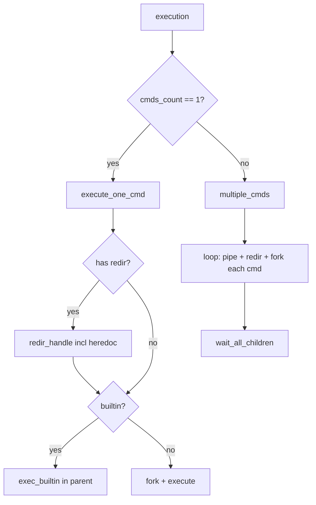

# Pipeline & Heredoc — Finishing Guide

> Based on your existing code in `execution.c`, `executeone.c`, `io-redir.c`, and `signals.c`.

---

## 🔴 Critical Bug First

Your `executeone.c` has `ignore_signals` and `default_signals` **swapped**:

```diff
 void	execute_non_builtin(t_exec *shell, t_cmd *node)
 {
 	ft_fork_pipe(shell, node, 1);
 	if (node->fork_id == 0)
 	{
-		ignore_signals();        // ← WRONG: child should get DEFAULT
+		default_signals();       // ← child needs SIG_DFL so Ctrl+C kills it
 		if (node->fd_in != 0)
-		apply_fd(node->fd_in, 0);
+			apply_fd(node->fd_in, 0);
 		if (node->fd_out != 1)
-		apply_fd(node->fd_out, 1);
+			apply_fd(node->fd_out, 1);
 		execute(shell, node);
 	}
-	default_signals();           // ← WRONG: parent should IGNORE during wait
+	ignore_signals();            // ← parent ignores while waiting
 	...
 	wait_child(shell, node);
 }
```

**Fix this before anything else.**

---

## Part 1 — Multiple Commands (Pipeline)

### The Big Picture

```
 ls -la  |  grep .c  |  wc -l
 ──────     ────────     ─────
  cmd1       cmd2        cmd3
```

```
     pipe0         pipe1
  ┌────────┐    ┌────────┐
  │ [0] [1]│    │ [0] [1]│
  └────────┘    └────────┘

cmd1            cmd2            cmd3
stdin → exec    pipe0[0]→exec   pipe1[0]→exec
stdout→pipe0[1] stdout→pipe1[1] stdout→stdout
```

**Rule**: For N commands you need **N-1 pipes**.

### The Algorithm

Your `multiple_cmds` skeleton already has the right idea. Here's the full logic:

```
multiple_cmds(shell, cmds_list):
    prev_fd = -1                    // read-end from previous pipe
    ignore_signals()                // parent ignores during execution

    while cmds_list:
        is_last = (cmds_list->next == NULL)

        // 1. Create pipe (only if NOT last command)
        if !is_last:
            pipe(shell->fd)         // shell->fd[0]=read, fd[1]=write

        // 2. Handle redirections BEFORE fork
        if cmds_list->redir:
            redir_handle(cmds_list->redir, &cmds_list)
        if !cmds_list:              // redir failed, destroyed node
            if prev_fd != -1: close(prev_fd)
            if !is_last: close(shell->fd[0]); close(shell->fd[1])
            break

        // 3. Set up fd_in / fd_out (only if no explicit redir overrode them)
        if prev_fd != -1 && cmds_list->fd_in == 0:
            cmds_list->fd_in = prev_fd
        else if prev_fd != -1:
            close(prev_fd)          // redir overrode, close unused pipe end

        if !is_last && cmds_list->fd_out == 1:
            cmds_list->fd_out = shell->fd[1]
        else if !is_last:
            close(shell->fd[1])     // redir overrode, close unused pipe end

        // 4. Fork + exec
        fork_and_exec_child(shell, cmds_list)

        // 5. Parent cleanup
        if cmds_list->fd_in > 2:
            close(cmds_list->fd_in)
        if cmds_list->fd_out > 2:
            close(cmds_list->fd_out)

        // 6. Save read-end for next command
        if !is_last:
            prev_fd = shell->fd[0]  // next cmd reads from this
        else:
            prev_fd = -1

        cmds_list = cmds_list->next

    // 7. Wait for ALL children (last one sets exit status)
    wait_all_children(shell)
```

### Mapping to Your Code

Here's what you already have and what you need to add:

| Need | You Have | Status |
|------|----------|--------|
| `pipe()` | `ft_fork_pipe(shell, node, 2)` | ✅ exists |
| `fork()` | `ft_fork_pipe(shell, node, 1)` | ✅ exists |
| `dup2 + close` | `apply_fd(fd1, fd)` | ✅ exists |
| Redir handling | `redir_handle()` | ✅ exists |
| `default_signals()` in child | `default_signals()` | ✅ exists |
| Wait all children | **need new function** | ❌ build it |

### New Function: `wait_all_children`

In a pipeline, you must **fork ALL children first**, then **wait for ALL of them**. You can't wait one-by-one because that would block the pipeline.

```c
void	wait_all_children(t_exec *shell)
{
	int		status;
	pid_t	pid;

	while (1)
	{
		pid = waitpid(-1, &status, 0);
		if (pid <= 0)
			break ;
		if (WIFEXITED(status))
			shell->last_status = WEXITSTATUS(status);
		else if (WIFSIGNALED(status))
		{
			shell->last_status = 128 + WTERMSIG(status);
			if (WTERMSIG(status) == SIGINT)
				write(1, "\n", 1);
			else if (WTERMSIG(status) == SIGQUIT)
				write(2, "Quit (core dumped)\n", 19);
		}
	}
}
```

> [!IMPORTANT]
> `waitpid(-1, ...)` waits for **any** child. The last one to be reaped sets `last_status`. In bash, the exit status of a pipeline is the exit status of the **last** command. Since `waitpid(-1)` returns children in arbitrary order, you need to track which PID is the last command's and only set `last_status` from that one.

Better version:

```c
void	wait_all_children(t_exec *shell)
{
	t_cmd	*cmd;
	int		status;
	pid_t	last_pid;

	// Find the last command's PID
	cmd = shell->cmds;
	while (cmd->next)
		cmd = cmd->next;
	last_pid = cmd->fork_id;
	// Wait for all children
	cmd = shell->cmds;
	while (cmd)
	{
		waitpid(cmd->fork_id, &status, 0);
		if (cmd->fork_id == last_pid)
		{
			if (WIFEXITED(status))
				shell->last_status = WEXITSTATUS(status);
			else if (WIFSIGNALED(status))
			{
				shell->last_status = 128 + WTERMSIG(status);
				if (WTERMSIG(status) == SIGINT)
					write(1, "\n", 1);
				else if (WTERMSIG(status) == SIGQUIT)
					write(2, "Quit (core dumped)\n", 19);
			}
		}
		cmd = cmd->next;
	}
}
```

### The Child Process (reuse your existing code)

Each child in the pipeline does the same thing your `execute_non_builtin` child does:

```c
// Inside the fork, for each command:
if (node->fork_id == 0)
{
    default_signals();
    if (node->fd_in != 0)
        apply_fd(node->fd_in, 0);
    if (node->fd_out != 1)
        apply_fd(node->fd_out, 1);
    // Close the pipe read-end the child doesn't use
    if (!is_last)
        close(shell->fd[0]);
    if (node->cmd_type == NONE)
        execute(shell, node);
    else
    {
        exec_builtin(shell, node);
        exit(shell->last_status);
    }
}
```

> [!WARNING]
> In a pipeline, **ALL commands (including builtins) must fork**. `echo hello | cat` — if `echo` doesn't fork, it runs in the parent and can't pipe its output. This is different from single-command execution where builtins run in the parent.

### FD Lifecycle Table

For `ls | grep .c | wc -l`:

```
                 pipe0[0] pipe0[1] pipe1[0] pipe1[1]
                 ──────── ──────── ──────── ────────
after pipe0:       open     open      -        -
fork cmd1:         open     →fd_out   -        -
parent close:      save     close     -        -
after pipe1:       saved    closed   open     open
fork cmd2:         →fd_in   closed   open     →fd_out
parent close:      close    closed   save     close
fork cmd3:         closed   closed   →fd_in   closed
parent close:      closed   closed   close    closed
wait_all:          closed   closed   closed   closed
```

> [!CAUTION]
> Every pipe end must be closed in the parent after it's been passed to a child. Unclosed pipe ends = commands that never finish (they hang waiting for EOF).

### Full `multiple_cmds` Implementation

```c
void	pipe_child(t_exec *shell, t_cmd *node, int is_last)
{
	default_signals();
	if (node->fd_in != 0)
		apply_fd(node->fd_in, 0);
	if (node->fd_out != 1)
		apply_fd(node->fd_out, 1);
	if (!is_last)
		close(shell->fd[0]);
	if (node->cmd_type == NONE)
		execute(shell, node);
	else
	{
		exec_builtin(shell, node);
		exit(shell->last_status);
	}
}

void	multiple_cmds(t_exec *shell, t_cmd *cmds_list)
{
	int	prev_fd;
	int	is_last;

	prev_fd = -1;
	ignore_signals();
	while (cmds_list)
	{
		is_last = (cmds_list->next == NULL);
		if (!is_last)
			ft_fork_pipe(shell, cmds_list, 2);
		if (cmds_list->redir)
			redir_handle(cmds_list->redir, &cmds_list);
		if (!cmds_list)
			break ;
		if (prev_fd != -1 && cmds_list->fd_in == 0)
			cmds_list->fd_in = prev_fd;
		else if (prev_fd != -1)
			close(prev_fd);
		if (!is_last && cmds_list->fd_out == 1)
			cmds_list->fd_out = shell->fd[1];
		else if (!is_last)
			close(shell->fd[1]);
		ft_fork_pipe(shell, cmds_list, 1);
		if (cmds_list->fork_id == 0)
			pipe_child(shell, cmds_list, is_last);
		if (cmds_list->fd_in > 2)
			close(cmds_list->fd_in);
		if (cmds_list->fd_out > 2)
			close(cmds_list->fd_out);
		if (!is_last)
			prev_fd = shell->fd[0];
		else
			prev_fd = -1;
		cmds_list = cmds_list->next;
	}
	wait_all_children(shell);
}
```

---

## Part 2 — Heredoc

### How Heredoc Works

```bash
cat << EOF
hello world
this is a heredoc
EOF
```

The shell reads lines until it sees the delimiter (`EOF`), writes them into a pipe, and the command reads from that pipe.

### The Algorithm

```
heredoc(delimiter, cmd):
    pipe(fd)
    while true:
        line = readline("> ")
        if !line || strcmp(line, delimiter) == 0:
            free(line)
            break
        write(fd[1], line, strlen(line))
        write(fd[1], "\n", 1)
        free(line)
    close(fd[1])              // done writing
    if cmd->fd_in > 2:
        close(cmd->fd_in)     // close any previous input redir
    cmd->fd_in = fd[0]        // command reads from pipe read-end
```

### Signal Handling in Heredoc

Heredoc needs special signal handling:
- **Ctrl+C** during heredoc → stop reading, return to prompt, `$?` = 130
- **Ctrl+D** (EOF) during heredoc → close heredoc normally (delimiter not found warning optional)
- **Ctrl+\\** → does nothing

```c
void	sigint_heredoc(int sig)
{
	(void)sig;
	g_sig = 130;
	write(1, "\n", 1);
	close(STDIN_FILENO);  // forces readline to return NULL
}

void	heredoc_signals(void)
{
	struct sigaction	sa_int;
	struct sigaction	sa_quit;

	sa_int.sa_handler = sigint_heredoc;
	sigemptyset(&sa_int.sa_mask);
	sa_int.sa_flags = 0;
	sigaction(SIGINT, &sa_int, NULL);
	sa_quit.sa_handler = SIG_IGN;
	sigemptyset(&sa_quit.sa_mask);
	sa_quit.sa_flags = 0;
	sigaction(SIGQUIT, &sa_quit, NULL);
}
```

> [!WARNING]
> Closing `STDIN_FILENO` in the signal handler forces `readline("> ")` to return `NULL`. After heredoc ends, you **must reopen stdin** with `dup2(saved_stdin, STDIN_FILENO)` or the shell is dead.

### Full Heredoc Implementation

```c
int	heredoc(char *delimiter, t_cmd **cmd)
{
	int		fd[2];
	int		stdin_backup;
	char	*line;

	if (pipe(fd) == -1)
		return (-1);
	stdin_backup = dup(STDIN_FILENO);
	heredoc_signals();
	while (1)
	{
		line = readline("> ");
		if (!line || !ft_strcmp(line, delimiter))
		{
			free(line);
			break ;
		}
		write(fd[1], line, ft_strlen(line));
		write(fd[1], "\n", 1);
		free(line);
	}
	close(fd[1]);
	dup2(stdin_backup, STDIN_FILENO);  // restore stdin if closed by signal
	close(stdin_backup);
	interactive_signals();             // restore interactive signals
	if (g_sig == 130)                  // Ctrl+C was pressed
	{
		close(fd[0]);
		free_current_cmd(cmd);
		return (-1);
	}
	if ((*cmd)->fd_in > 2)
		close((*cmd)->fd_in);
	(*cmd)->fd_in = fd[0];
	return (0);
}
```

### Plug Into `redir_handle`

In your [io-redir.c](file:///home/moabed/Documents/Minishell/src/io-redir.c#L81-L84):

```c
else if (redir->type == HEREDOC)
{
	if (heredoc(redir->filename, cmd) == -1)
		return ;  // Ctrl+C or error, cmd is already freed
}
```

> [!IMPORTANT]
> **Heredoc must be processed BEFORE execution**, ideally before any forks. If you have `cat << EOF | grep hello`, both heredocs should be collected before any child process starts. This is how bash does it. For your current architecture, since `redir_handle` runs before fork, you're already in the right place.

---

## Part 3 — Putting It All Together

### Execution Flow



### Cleanup in `execution()`

After `multiple_cmds` returns, you need to free all the command nodes:

```c
void	execution(t_exec *shell)
{
	init_vals(shell, shell->cmds);
	if (shell->cmds_count == 1)
		execute_one_cmd(shell, shell->cmds);
	else
		multiple_cmds(shell, shell->cmds);
	ruin_everything(shell);  // free remaining cmd nodes
}
```

---

## Testing Checklist

### Pipeline Tests
```bash
# Basic pipe
ls | cat
ls | grep .c
echo hello | cat

# Multi-pipe
ls | grep .c | wc -l
cat /etc/passwd | grep root | head -1

# Builtin in pipeline (must fork)
echo hello | cat
export | grep PATH

# Exit status = last command
false | true          # $? = 0
true | false          # $? = 1

# Signal in pipeline
sleep 100 | sleep 100     # Ctrl+C should kill both, $? = 130
```

### Heredoc Tests
```bash
# Basic heredoc
cat << EOF
hello
EOF

# Heredoc with pipe
cat << EOF | grep hello
hello
world
EOF

# Ctrl+C during heredoc (should return to prompt, $? = 130)
cat << EOF
^C

# Ctrl+D during heredoc (EOF, closes normally)
cat << EOF
^D

# Multiple heredocs
cat << A << B
first
A
second
B
# Only the LAST heredoc feeds stdin
```

### Signal Tests
```bash
sleep 10        # Ctrl+C → $? = 130
sleep 10        # Ctrl+\ → $? = 131, prints "Quit (core dumped)"
# At prompt: Ctrl+C → new prompt, $? = 130
# At prompt: Ctrl+\ → nothing
```
